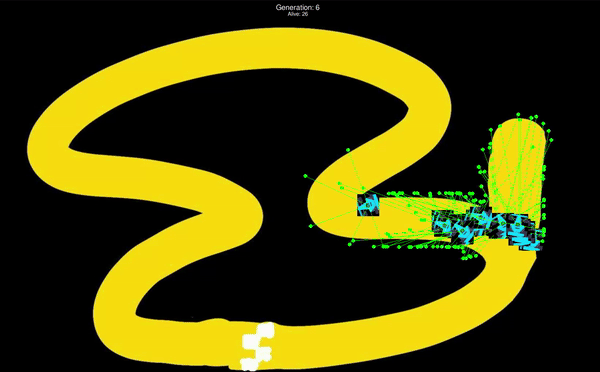

# Evolutionary Neural Network for Racecar on Hand-drawn Track

This project implements an Evolutionary Neural Network using the NEAT (NeuroEvolution of Augmenting Topologies) module to control a racecar on a hand-drawn track.



## Project Overview

- **Objective**: Train an AI agent (racecar) to navigate a custom, hand-drawn track autonomously.
- **Technology Used**: Python, NEAT module, Pygame (for visualization).

## Requirements

- Python 3.x
- NEAT Python module
- Pygame

## Setup Instructions

1. Clone the repository:
   ```bash
   git clone https://github.com/adityak1429/race_car_evolution_NEAT.git
   cd race_car_evolution_NEAT

